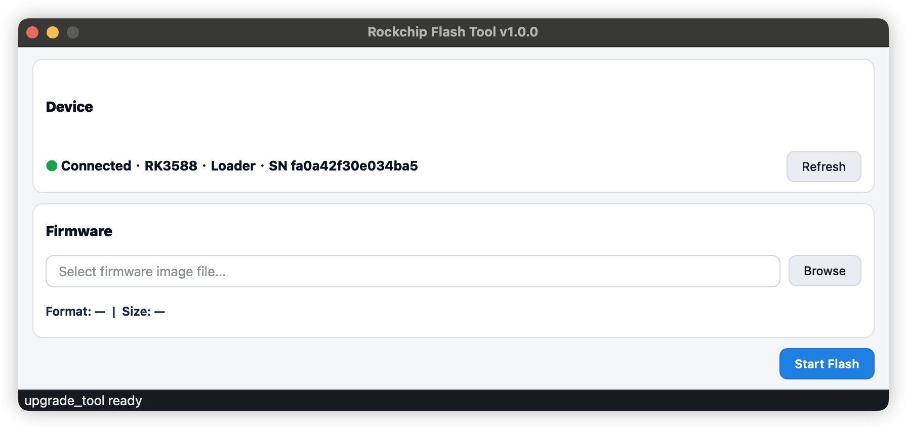

# Rockchip Flash Tool

Rockchip Flash Tool is a cross-platform desktop application that turns Rockchip flashing into a simple, consistent user experience.

## Visual Preview

### App Interface Screenshot

## Download

- Latest release: [Download Here](https://github.com/evtest-hash/rockchip-flash-tool/releases/latest)
- All releases: [Release History](https://github.com/evtest-hash/rockchip-flash-tool/releases)

## Why This Tool Exists

Rockchip flashing is often difficult for end users because many conditions change the required process.

Typical pain points:

1. Different chip models require different loader matching.
2. Devices may be in different flashing modes, and each mode needs a different flow.
3. Firmware formats are different, and the operation path changes accordingly.
4. Some platforms require extra driver preparation.
5. Users often need different tools on different operating systems.

## Design Philosophy

This tool abstracts those differences and hides unnecessary complexity.

The user-facing workflow is intentionally simple:

1. Select firmware.
2. Click **Start Flash**.

Users do not need to learn low-level flashing details to complete the task correctly.

## Core Advantages

- One consistent experience across macOS, Windows, and Linux.
- Fewer manual decisions, fewer human errors.
- Faster onboarding for new operators.
- Better operational consistency in lab, factory, and field scenarios.
